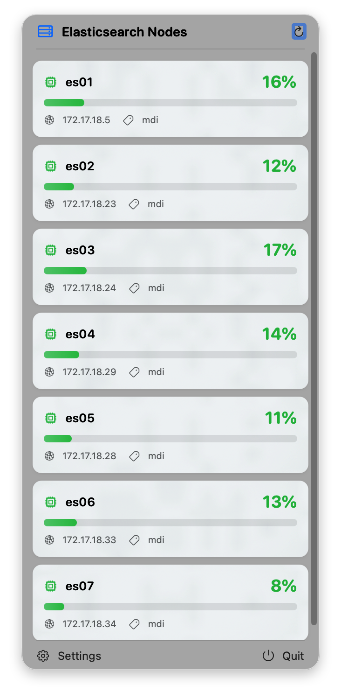
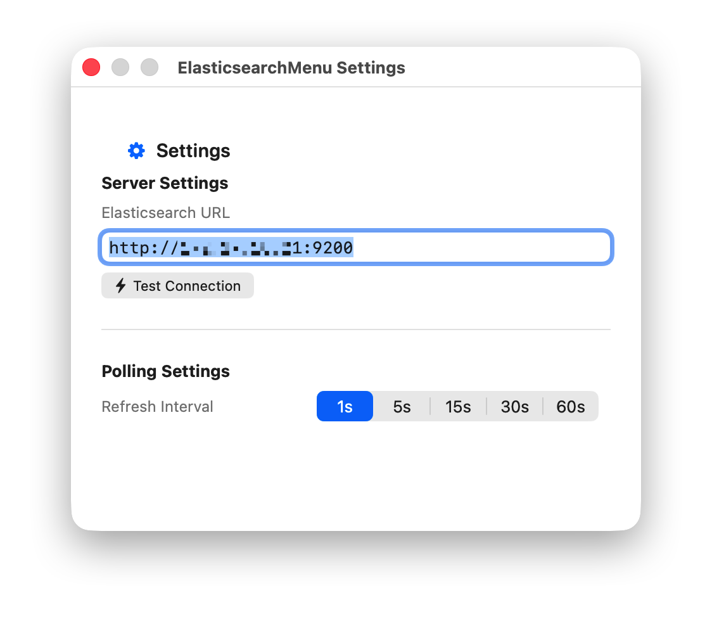

<div align="center">

# Elasticsearch Status 🔍




<p>
  A lightweight, native macOS menu bar application to monitor your Elasticsearch cluster directly from your status bar.
</p>

</div>

---

## 🌟 Features

- **Native & Lightweight**: Built fully with pure SwiftUI for optimal macOS integration.
- **Menu Bar Access**: Quickly view the real-time status of your Elasticsearch cluster nodes without opening a full application.
- **Real-time Monitoring**: Monitor vital node metrics, track availability, and handle connection errors elegantly.
- **Customizable Configuration**: Customize your Elasticsearch server endpoint and monitoring polling intervals.
- **Dynamic UI**: The nodes view dynamically resizes depending on current cluster capacity to save screen real estate.

## 🚀 Quick Start

### Prerequisites

- macOS 13.0+ (Ventura) or newer
- Xcode 14.0+
- An accessible Elasticsearch Server

### Build and Run

1. Clone this repository:
   ```bash
   git clone git@github.com:qingx2/ElasticStatus.git
   cd ElasticStatus
   ```

2. Open the project in Xcode:
   ```bash
   open ElasticStatus.xcodeproj
   ```
   *(Or just open the project folder directly via Xcode)*

3. Select your Mac as the build destination.
4. Build and Run (`Cmd + R`).

## ⚙️ Usage

1. Launch the app and a server rack icon will appear in your macOS menu bar.
2. Click the icon to view your cluster nodes list.
3. Click on the **Settings** icon (gear shape) at the bottom left to configure:
   - Your **Elasticsearch Server URL**.
   - Your preferred **Auto-Refresh Interval**.
4. The monitor will poll your server automatically in the background as configured.

## 🤝 Contributing

Contributions, issues, and feature requests are always welcome!

1. Fork the Project
2. Create your Feature Branch (`git checkout -b feature/AmazingFeature`)
3. Commit your Changes (`git commit -m 'Add some AmazingFeature'`)
4. Push to the Branch (`git push origin feature/AmazingFeature`)
5. Open a Pull Request

## 📄 License

Distributed under the MIT License. See `LICENSE` for more information.

## 🙏 Acknowledgements

- Built gracefully with [SwiftUI](https://developer.apple.com/xcode/swiftui/)
- [SF Symbols](https://developer.apple.com/sf-symbols/) for beautiful standard icons
